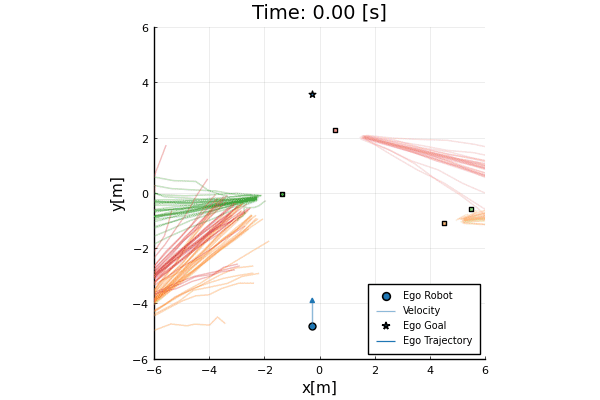
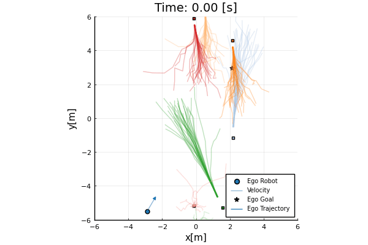

# DistributionallyRobust.jl

This is official code repository of "Distributionally Robust Risk-Aware Control Framework for Safe Crowd Navigation with Human Motion Predictions".  
This code is based on code of "Risk Sensitive Sequential Action Control" (MIT License) [RSSAC code](https://github.com/StanfordMSL/RiskSensitiveSAC.jl).




## Installation
Tested on Julia 1.8.5 & Python 3.6   
This is summary for installing all submodules and dependencies.

### Cloning
Clone the submodules when cloning this repository. Submodules included in this repository is   
- Trajectron-plus-plus
- CrowdNav
- Python-RVO2

```
git clone --recurse-submodules <repository cloning URL>
```

### Environment Setup
Since Trajectron-plus-plus module is based on python 3.6, which is bit outdated, we recommend to use conda environment for environment setup.   
First, create conda environment and install dependencies for Trajectron++.  
```
conda create --name [your conda environment name] python=3.6 -y
conda activate [your conda environment name]
cd Trajectron-plus-plus
pip install -r requirements.txt
```

We have to install Python-RVO2 library to install CrowdNav.  
We can start with installing CMake and Cython.  
Install the tested version of Cython for Python-RVO2.   
```
cd ../Python-RVO2
pip install -r requirements.txt
```
Build and install.  
```
python setup.py build
python setup.py install
```

If Python-RVO2 is installed successfully, we can install CrowdNav.  
```
cd ../CrowdNav
pip install -e .
```

## Submodule Training

### Trajectron++
We have to get trained Trajectron++ module for our DRCC-MPC.  
Training procedure for Trajectron++ is givn in its [repository](https://github.com/StanfordASL/Trajectron-plus-plus?tab=readme-ov-file#installation).   
We are only working with Pedestrian Dataset in here.  

### Load trained Trajectron++ module
You can access to pretrained Trajectron++ module in [RSSAC repository](https://github.com/StanfordMSL/RiskSensitiveSAC.jl/tree/master).   
They are under `Trajectron-plus-plus/experiments/pedestrians/models`. Download trained model and put it in same directory to use the model.  

### CrowdNav
You can also follow the [CrowdNav training procedure](https://github.com/vita-epfl/CrowdNav/tree/20d678085c06831e658a65b9e20c8bb6f6ecdc10).   
However, it is not necessary if you are not planning to to experiments with CrowdNav. You may have to change training configuration in `crowd_nav/configs`.   
For example, if you want to test CrowdNav with pedestrian dataset, you should change `time_step = 0.4` in `env.config` to comply with dataset timestep.

## Install Julia
We can install Julia from [official webpage](https://julialang.org/downloads/).  
Note that this module is tested with Julia 1.8.5  
You may want to install julia within your conda environment and it is possible. However, installing julia within conda env is not tested.  

Julia can call python function using PyCall. Our integration with Trajectron++ and CrowdNav is achieved through PyCall.  
If you open notebook file in editor after activating conda environment, it will automatically detect python version in conda and use it for PyCall.  

## Compatability issue
Plot.jl now doesn't support matplotlib < 3.4.0    
Since python 3.6 does not support matplotlib >= 3.4.0, we had to go around this compatability issue.   
One temporary solution is save result data in corrent conda environment and plot in other conda environment with newer matplotlib.  

1. Save result data as jld2 file
2. Create another conda environment with python >= 3.7 and matplotlib >= 3.4.0
3. Open load_data.ipynb with this conda environment and plot the result
